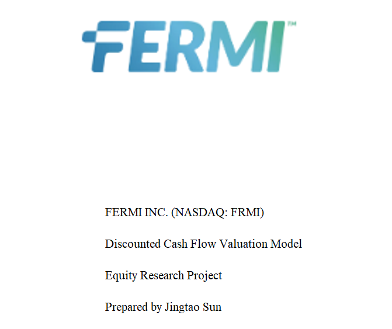
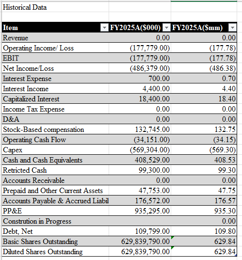
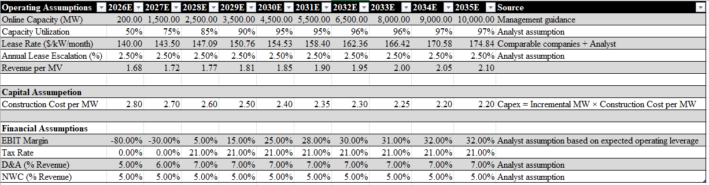
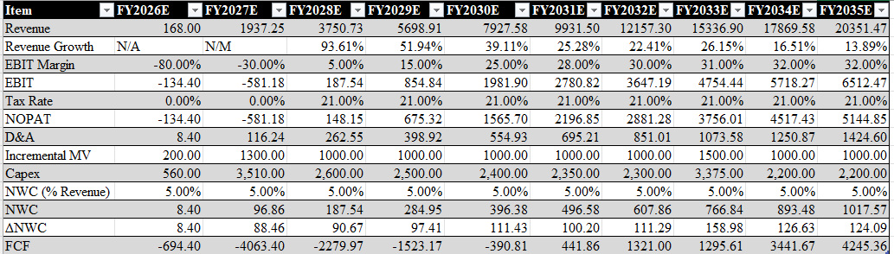
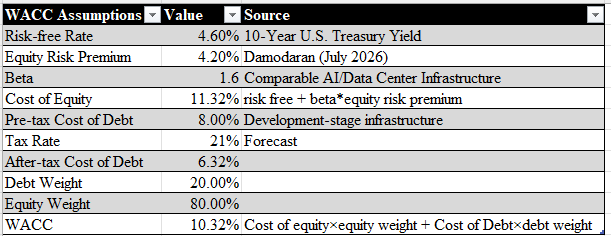
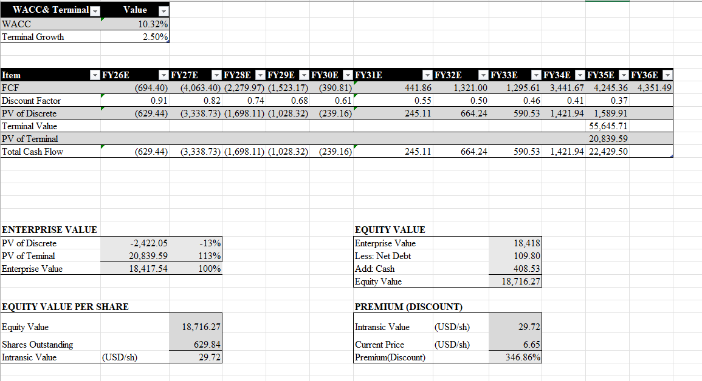
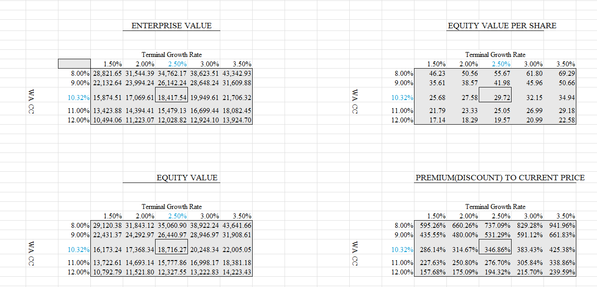

# Fermi Inc. (NASDAQ: FRMI) – Discounted Cash Flow (DCF) Valuation Model

## Overview

This project presents a full three-statement style financial forecast and Discounted Cash Flow (DCF) valuation model for **Fermi Inc. (NASDAQ: FRMI)**, a development-stage AI infrastructure company focused on building large-scale private power campuses for hyperscale AI customers.

The model was built entirely in Microsoft Excel following investment banking and equity research modeling conventions.

---

## Project Objectives

- Analyze Fermi's historical financial performance
- Forecast operating performance based on management guidance
- Build a driver-based operating model
- Estimate intrinsic enterprise and equity value using DCF
- Perform valuation sensitivity analysis across WACC and Terminal Growth assumptions

---

## Model Structure

The Excel model contains the following worksheets:

| Worksheet | Description |
|-----------|-------------|
| Cover | Project cover page |
| Historical Data | Historical financial statements (FY2025A) |
| Assumptions | Operating, financial and valuation assumptions |
| Forecast | Revenue, EBIT, Free Cash Flow forecast (FY2026E–FY2035E) |
| WACC Assumptions |
| DCF Valuation & Sensitivity Analysis  | Enterprise Value, Equity Value and Intrinsic Value calculation | WACC × Terminal Growth valuation matrix |

---

## Model Preview

### Cover Page



### Historical Data



### Operating Assumptions



### Operating Forecast



### WACC Assumption




### DCF Valuation



### Sensitivity Analysis




# Valuation Methodology

The valuation follows the standard Enterprise DCF approach.

Enterprise Value is estimated as:

```
Enterprise Value
=
PV of Explicit Forecast Period FCF
+
PV of Terminal Value
```

Terminal Value is estimated using the Gordon Growth Model:

\[
TV=\frac{FCF_{n+1}}{WACC-g}
\]

Equity Value is calculated as:

```
Enterprise Value
- Total Debt
+ Cash & Cash Equivalents
=
Equity Value
```

Intrinsic Value per Share is calculated as:

```
Equity Value
/
Diluted Shares Outstanding
```

---

# Operating Assumptions

Since Fermi has not yet generated operating revenue, a traditional historical growth forecast is not appropriate.

Instead, a **driver-based operating model** was constructed using:

- Online Capacity (MW)
- Capacity Utilization
- Lease Rate ($/kW/month)
- Annual Lease Escalation
- Construction Cost per MW

Revenue is forecast as:

```
Revenue
=
Online Capacity
×
Capacity Utilization
×
Revenue per MW
```

Revenue per MW is derived from:

```
Lease Rate × 1000 × 12
```

---

# Financial Assumptions

The model includes assumptions for:

- EBIT Margin
- Tax Rate
- Depreciation & Amortization
- Net Working Capital
- Capital Expenditures

Capital expenditures are forecast using:

```
Incremental MW
×
Construction Cost per MW
```

rather than a simple Capex as a percentage of revenue.

---


# Data Sources

### Company Filings

- Fermi Inc. FY2025 Form 10-K
- SEC EDGAR

### Market Data

- U.S. 10-Year Treasury Yield
- Damodaran Implied Equity Risk Premium
- Comparable AI Infrastructure and Data Center Companies

### Comparable Companies

- Equinix
- Digital Realty
- Applied Digital
- Hut 8
- Core Scientific

---

# Key Assumptions

This model incorporates both management guidance and analyst assumptions.

### Management Guidance

- Project development timeline
- Online capacity roadmap
- Revenue model
- Business strategy
- Capital deployment

### Analyst Assumptions

- Capacity utilization
- Lease pricing
- Lease escalation
- Operating margins
- Capital expenditures
- Long-term growth rate
- WACC

---

# Sensitivity Analysis

The model includes valuation sensitivity tables for:

- Enterprise Value
- Equity Value
- Intrinsic Value per Share
- Premium / Discount to Current Market Price

Sensitivity variables include:

- WACC
- Terminal Growth Rate

---


# Skills Demonstrated

- Financial Modeling
- Discounted Cash Flow (DCF)
- Forecasting
- Equity Valuation
- Sensitivity Analysis
- Excel Financial Modeling
- Investment Banking Modeling Standards

---

## Author

**J S**
